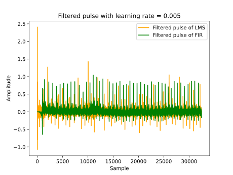
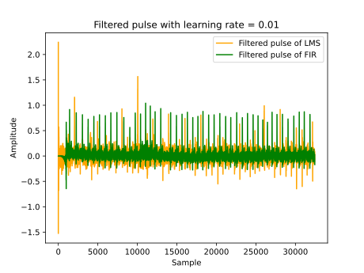
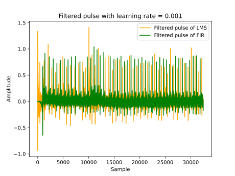

# FIR Filters

## Introduction

In this assignment, we focus on signal processing in electrocardiogram (ECG) using the Finite Impulse Response (FIR) filtering method, where the impulse response is for a finite ratio. This is a causal signal processing method where the system processes the incoming signal in real-time, ideally with negligible latency, instead of requiring the complete sample to be processed. An adaptive FIR Least Mean Squares (LMS) filter is also used to make the FIR filter adaptive by changing the coefficients and learning the optimal filter coefficients over time. A matched filter is also written to detect the R-peaks signal for a noisy ECG.

## FIR filter implementation

FIR Filter Coefficients for a combined high pass and band stop filter:
The function calculate_coefficients() in the FIR filter python file generates the FIR filter coefficients numerically and does both highpass and bandstop filtering. The number of taps “M” is calculated automatically using the equation $M = \frac{f_s}{\Delta{F}}$ where $f_s$ = sampling frequency and $\Delta{F}$ = frequency resolution. The frequency resolution is the high pass cut-off frequency value to filter out the DC component correctly, which is below 1 Hz, and does not affect the fundamental frequency, which is 1Hz. Hence, this inversely related calculation will increase the number of taps as the cut-off frequency decreases. Therefore, this design would cause a delay in response for an increased number of taps, as seen from our FIR filter time-domain plot in Figure 1.


Figure 1: The time-domain response of the full ECG signal spectrum of lying subject showing the unfiltered (raw pulse) ECG in blue and the FIR filtered (filtered pulse) in orange. At the beginning of the filtered pulse there is an indication of delay.

FIR filter design procedure was to first get an impulse response for the filter by performing the inverse fast Fourier transform to get x(n) in sample domain, taking only its real values, shift the signal to make it in positive time and make it causal. A Hamming window is then applied to the coefficients to truncate it without distorting the filter response. The impulse response is shown below in figure 2 and figure 3 shows the behaviour of the ECG signal in time-domain using the other window functions. Hamming was used as it is standard in many applications and there was not much difference between them when we tested them. 

```python
def calculate_coefficients(fs, bs_cutoff_freqs, hp_cutoff_freq):
   ...
   ...
    # x(n) is the sample domain of the filter:- impulse response 
    x = np.fft.ifft(X)
    # real value only so we don't take the imaginary part of the signal and leave the real part as it is.
    x_real = np.real(x)

    h = np.zeros(M)

    # Shift the signal to make it causal and swap -ve and +ve time:
    mid = int(M / 2)
    h[0:mid] = x_real[mid:M]
    h[mid:M] = x_real[0:mid]

    h = h * np.hamming(M)
    return h
```


Figure 2: The M-tap (2000) FIR filter impulse response which shows the truncated side lobes using hamming window in orange and the non- window function impulse response in blue(underlapped of the orange plot, with side lobe ripple ).

Using Different window functions for ECG in time-domain:


Figure 3: Using different window function with filter coefficients.

The high pass filter removes the DC shift or baseline wander (BW) for the ECG data, as this low-frequency artefact arises due to subject respiration. In electrocardiogram (ECG) signal recordings, this low frequency (below 0.5Hz) makes interpretation of ECG recordings difficult. As the filter design is not an ideal step-function filter response, instead a smooth transition from the stopband to passband, the high pass filter cutoff frequency in this assignment was 0.5Hz, which is below the ECG fundamental frequency of 1Hz, ensuring this frequency is not attenuated by the high-pass filter. 

The band stop filter is designed to eliminate the undesired mains power 50Hz interference frequency, and in this assignment, the cutoff frequency was specified for a range of 45-55 Hz. These frequencies were identified when an FFT was performed on the original ECG data and are shown in Figure 4 below. Figure 4 also shows the removal of these frequencies after the filter is applied. Figure 5 shows the combined high pass and band stop filter design in the frequency spectrum.


Figure 4: The frequency plot of the ECG signal showing the original unfiltered- frequency spectrum in blue and the filtered signal in orange.


Figure 5: The designed combined high pass and band stop filter indicating high pass for frequencies > 0.5Hz and band stop filtering between 45Hz to 55Hz.

## FIR filter Class and Simulation of real time processing

### FIR implementation

To make an FIR filter, a class `FIRfilter` is created to accommodate that with ntaps, coefficients and buffer attributes.

```python
def __init__(self, _coefficients):
    self.ntaps = len(_coefficients)
    self.coefficients = _coefficients
    self.buffer = np.zeros(self.ntaps)
```

`Coefficients` are calculated from the previous task as a bandstop and highpass filters combined. `ntaps` is simply the length of the coefficient list and the `buffer` is implemented as a ring buffer (initiated as list of ntaps zero elements).

```python
def dofilter(self, v):
    self.buffer = np.roll(self.buffer, shift=1)
    self.buffer[0] = v
    return np.sum(self.buffer * self.coefficients) 
```

The filtering operation is demonstrated by the `dofilter()` function. The `buffer` simulates a ring buffer using `np.roll()` to shift the buffer by one element. Doing so will move the last element in the buffer to index 0, and then we swap this with our new pulse value. The result is the sum of the product of the updated buffer and the filter coefficients. This result is returned as the output of the filter.


### Making the coefficients

The `filtering_with_FIR` function utilizes the coefficients generated by `calculate_coefficients` to filter an array of ECG pulses. It creates an instance of an FIR filter with the calculated coefficients and applies it to each pulse in the input array. This process effectively removes the unwanted frequencies, as determined by the cutoff frequencies and keeps the essential frequencies required from an ECG signal typically found within the filter's passband. The filtered FIR ECG signal in the time domain is shown in Figure 1 on page 2 as the orange-coloured plot

```python
def filtering_with_FIR(fs, pulses):
    # filter coefficients are a bandstop filter with cutoff frequencies of 45Hz and 55Hz and a high pass filter with cutoff frequency of 1Hz:
    h = calculate_coefficients(fs, [45, 55], 0.5)

    fir_filter = FIRfilter(h)

    filtered_pulse = []

    for i, pulse in enumerate(pulses):
        filtered_pulse.append(fir_filter.dofilter(pulse))
    return filtered_pulse
```


Figure 6: This plot shows in the time-domain one ECG cycle using FIR filter indicating the different part a single heartbeat.

Last figure shows one ECG cycle of a subject when lying down after FIR filter is done. The QRS complex of the ECG signal can be seen, and the T wave seen better than the P wave. This could be improved by removing higher unwanted frequencies by using a low-pass filter.

## Adaptive LMS Filter Design

The function `doFilterAdaptive` in the assignment is designed to allow the coefficients of the FIR filter to change while it operates. In this method, an error signal $e(n)$ is calculated by comparing output $y(n)$ with our noisy input signal $d(n)$.

$$e(n) = d(n) - y(n)$$


### LMS filter implementation

The `doFilterAdaptive()` function demonstrates the LMS filter operation:

```python
def doFilterAdaptive(self, signal, noise, learningRate):
    filtered_noise = self.doFilter(noise)
    error = signal - filtered_noise
    # update coefficients
    for i in range(self.ntaps):
        self.coefficients[i] += learningRate * error * self.buffer[i]
    return error
```

In this code, filtered_noise is the noise signal we want to remove from our signal $d(n)$. Error is calculated as described in the equation $d(n) - y(n)$, where $y(n)$ is the output from the FIR filter. Then, we update the coefficients, and that is what makes the LMS filter adaptive because it makes the FIR filter coefficients vary over time to “learn” the characteristics of the noise signal, allowing it to dynamically adjust to changes in the noise properties for better cancellation. After that, the output returned is simply the error signal.

### LMS filter results

In the plot below, we can see the differences between FIR (green) and LMS (orange) filters. FIR filter has an initial delay at the beginning until the filter gets enough data in the buffer to do effective filtering. In contrast, the LMS filter does not filter the noise efficiently at the beginning until it learns from enough samples. It is important to note that there is no delay in the LMS filter compared to the FIR filter. When the LMS filter reaches a point where it can perform filtering effectively, new data will be filtered accordingly.


Figure 7: Comparison of FIR filter of ECG signal with the LMS filtering method.


Figure 8: This plot shows in the time-domain one ECG cycle using the LMS method indicating the different part a single heartbeat. The P wave is not ideally indicated.

### Using different learning rates

The gradient descent method is used to change the filter coefficients in the LMS filter to find the best coefficient values over time. From the name of the filter (Least Mean Square), finding the best coefficients is done by minimising $e(n)^2$. It is squared because the sign of the error doesn’t matter, but its amplitude does. Therefore, a learning rate is used in the equation to adapt how fast the filter should learn, affecting the performance and accuracy of the filter. This is demonstrated in this code.

```python
self.coefficients[i] += learningRate * error * self.buffer[i]
```

The plots below show how different learning rates affect the filter’s performance and the importance of optimising this variable:





Figure 9: Using different learning rates with the LMS filter.

As shown above, larger learning rate values such as 0.01 can mess up the filtered signal as it will not find values for the coefficients that are close enough to the optimal values because of this. Therefore, even though the learning period at the beginning is shorter than the others, the output of the filter is noisier than the FIR filter’s output as the coefficients aren’t optimised.

Having a value even more significant than that, e.g. 0.1, breaks the signal as the coefficients are very far from optimal, and the filter filters the entire signal.

Smaller learning rates will better filter out the noise but increase the learning period.

After trying various learning rates and comparing them, we found that 0.001 gives us the best learning period and performance.

## Matched filters

This section of the assignment uses a matched filter to detect the R-peaks, which can be used for heart rate monitoring when there is a match with the ECG signal and template. 

The methodology of writing the code followed this block diagram in Figure 10 below:


Figure 10: The block diagram implementation for writing the matched filter code.

To create a matched filter impulse response, there needs to be a template obtained from a slice out of the FIR filtered ECG standing data. This template is then inverted or reversed so that the signal can be correlated with the ECG signal when it aligns with time.

```python
def matched_filter(pulses, fs):
    # pre-filtering ECG signal : beginning stages
    filtered_pulse = filtering_with_FIR(fs, pulses) 
    # obtain template
    template = filtered_pulse[1200:1800]
    # time reversed template
    template_reversed = template[::-1]
```

This line creates an FIR filter object named detector, which will act as the matched filter. The filter's impulse response is set to the reversed template extracted from a segment of the FIR filtered ECG signal.

To apply the matched filter with the FIR filtered ECG signal, the detector takes sample by sample.

Each sample value stored in detections is then squared to improve the signal-to-noise ratio and allow  better distinguishing of the R-peaks.

```python
def matched_filter(pulses, fs):
...
    detector = FIRfilter(template_reversed)
    detections = []
    for i, pulse in enumerate(filtered_pulse):
        detections.append(detector.dofilter(pulse))

    # square detections , x* x ;
    detections = [detection**2 for detection in detections]
...
```

To identify significant peaks in the detection array, a threshold is defined as the mean of the squared detection. Any low-value detections which are not R-peaks are set to 0, and then a heuristic is applied to isolate any false positive peaks from the signal. The initial assumption was that the heuristic code may be working; however, upon further examination, this code is not as ideal now as intended.

```python
threshold = np.mean(detections)
# check if detection above threshold:
for i, detection in enumerate(detections):
    if detection < threshold:
        detections[i] = 0

# apply heuristic to remove false positives:
for i in range(1, len(detections)-1):
    if detections[i] != 0 and detections[i-1] == 0 and detections[i+1] == 0:
        detections[i] = 0
```

The matched filter showing the R-peaks in the time domain is shown in Figure 11 below, where the matched filter before heuristics applied is underlapped as an orange plot. Some false positive R-peaks before the heuristic is applied are removed after the heuristics are used.


Figure 11: The plot of heuristic applied matched filter in the time-domain (green plot) for the standing ECG. The blue straight line shows the threshold value and the non- heuristic applied match filter (orange plot) is under lapped.


Figure 12: A closer view of False positive peaks which got removed when using the heuristic.


## Momentary Heart Rate

The R peaks of the ECG signal were found, but the momentary heart rate needs to be calculated correctly. The code we implemented didn’t figure it out accurately, and due to time, we couldn’t get it to work. However, we can fix the heart rate calculation by revising the peak detection process and ensuring the time between R peaks is measured correctly with the sampling rate. This will allow us to determine the momentary heart rate from the ECG data accurately. The R peaks detections plot is shown in Figure 13 below.

```python
R_peaks = []
for i, detection in enumerate(detections):
    if detection != 0 and detection > detections[i-1] and detection > detections[i+1]:
        R_peaks.append(i)
time_between_R_peaks = []
for i in range(len(R_peaks)-1):
    time_between_R_peaks.append(
        (R_peaks[i+1] - R_peaks[i]) / fs)
peak_time = np.array(R_peaks) / fs
```


Figure 13: R-peak detections from the ECG signal.

## Conclusion

In conclusion, this assignment has demonstrated the application using FIR filters as causal signal processing. The FIR filter design, with its combined highpass and bandstop functionalities, eliminated DC shift and 50Hz mains interference allowing for clearer ECG signal interpretation for subject when lying.

The Ring buffer implementation for the FIR filter can be improved. We have a buffer that is simulating the ring buffer behaviour by linearly shifting the buffer and amending the first index. For better efficiency, an buffer index can be used to only amend that index. This would implement a true ring buffer. However, the overall performance of the FIR filter was more stable than the LMS filter with a consistent and clear heart peak.

The adaptive LMS filter further enhanced the filtering process by dynamically changing the coefficients of the FIR filter. The matched filter was able to detect R-peaks for heart rate monitoring, despite some limitations in false-positive peak discrimination. This could be addressed through refining the heuristic implementation.

For the matched filter section we couldn’t obtain a satisfactory momentary heart rate calculation for this assignment, we think this could be improved by tuning the peak detection algorithm.
